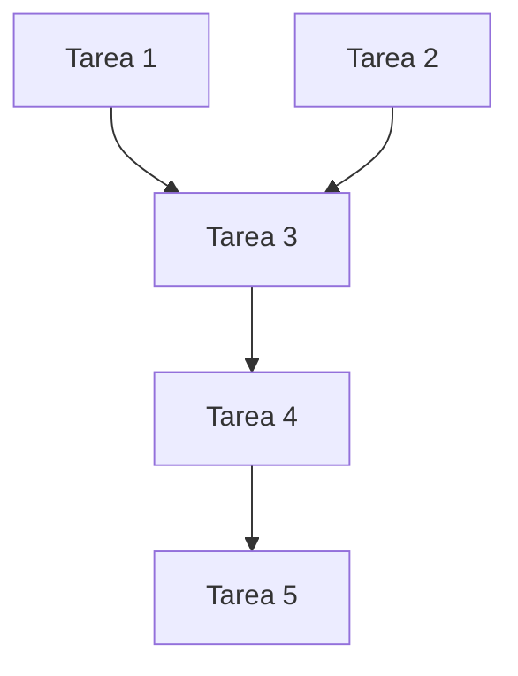

# Dependencias de la Fase XX

## Dependencias de Fases Anteriores

### ✅ Fase [N-1]: [Nombre de la Fase]

**Estado:** Completada | En progreso | Bloqueada

**Entregables requeridos:**
- [ ] **[Entregable 1]** - [Descripción de qué necesitamos]
  - **Estado:** Disponible | Pendiente | Parcial
  - **Fecha requerida:** YYYY-MM-DD
  - **Responsable:** [Nombre]
  - **Impacto si no está:** [Qué se bloquea]

- [ ] **[Entregable 2]** - [Descripción de qué necesitamos]
  - **Estado:** Disponible | Pendiente | Parcial
  - **Fecha requerida:** YYYY-MM-DD
  - **Responsable:** [Nombre]
  - **Impacto si no está:** [Qué se bloquea]

**Decisiones arquitectónicas requeridas:**
- [ ] **ADR-XXX:** [Nombre de la decisión]
  - **Estado:** Tomada | Pendiente
  - **Fecha límite:** YYYY-MM-DD
  - **Impacto:** [Qué se bloquea sin esta decisión]

---

### ⏳ Fase [N-2]: [Nombre de la Fase]

**Estado:** Completada | En progreso | Bloqueada

**Entregables requeridos:**
- [ ] **[Entregable X]** - [Descripción]
  - **Estado:** Disponible | Pendiente | Parcial
  - **Fecha requerida:** YYYY-MM-DD
  - **Responsable:** [Nombre]
  - **Impacto si no está:** [Qué se bloquea]

## Dependencias Externas

### 🌐 Servicios/APIs de Terceros

- **[Nombre del servicio]**
  - **Descripción:** [Qué necesitamos del servicio]
  - **Estado:** Disponible | En configuración | Bloqueado
  - **Contacto:** [Persona responsable externa]
  - **Fecha crítica:** YYYY-MM-DD
  - **Plan B:** [Alternativa si no está disponible]

### 🛠️ Herramientas y Tecnologías

- **[Nombre de herramienta/tecnología]**
  - **Versión requerida:** [Versión específica]
  - **Estado:** Instalada | Pendiente instalación | En evaluación
  - **Responsable instalación:** [Nombre]
  - **Fecha límite:** YYYY-MM-DD
  - **Alternativas:** [Si las hay]

### 👥 Recursos Humanos

- **[Rol/Expertise necesario]**
  - **Descripción:** [Qué tipo de ayuda necesitamos]
  - **Disponibilidad requerida:** [Cuánto tiempo/cuándo]
  - **Estado:** Confirmado | Pendiente | No disponible
  - **Persona asignada:** [Nombre o por definir]
  - **Fecha crítica:** YYYY-MM-DD

## Dependencias Internas de Esta Fase

### Tareas con Dependencias

### Entregables con Dependencias
- **[E01]** necesita que **[E02]** esté completado
- **[E03]** depende de **[Tarea X]** de otra fase
- **[E04]** requiere aprobación externa antes de comenzar

## Riesgos de Dependencias

| Dependencia | Riesgo | Probabilidad | Impacto | Mitigación | Responsable |
|-------------|--------|--------------|---------|------------|-------------|
| [Nombre] | [Descripción del riesgo] | Alta/Media/Baja | Alto/Medio/Bajo | [Estrategia] | [Nombre] |
| [Nombre] | [Descripción del riesgo] | Alta/Media/Baja | Alto/Medio/Bajo | [Estrategia] | [Nombre] |

## Plan de Contingencia

### Si Dependencia Crítica se Retrasa

**Dependencia:** [Nombre de la dependencia crítica]

**Acciones:**
1. **Inmediato (0-24h):**
   - [ ] [Acción específica]
   - [ ] [Acción específica]

2. **Corto plazo (1-7 días):**
   - [ ] [Acción específica]
   - [ ] [Acción específica]

3. **Largo plazo (>7 días):**
   - [ ] [Acción específica]
   - [ ] [Acción específica]

**Responsable del plan:** [Nombre]

## Seguimiento de Dependencias

### Reuniones de Estado
- **Frecuencia:** [Semanal/Bisemanal]
- **Participantes:** [Lista de personas clave]
- **Objetivo:** Revisar estado de dependencias críticas

### Dashboard de Dependencias

| Dependencia | Estado | Fecha Límite | Días Restantes | Semáforo |
|-------------|--------|--------------|---------------|-----------|
| [Nombre] | [Estado] | YYYY-MM-DD | XX | 🔴/🟡/🟢 |
| [Nombre] | [Estado] | YYYY-MM-DD | XX | 🔴/🟡/🟢 |

### Alertas Automáticas
- **🔴 Crítico:** Dependencia vence en <3 días
- **🟡 Atención:** Dependencia vence en <7 días  
- **🟢 OK:** Dependencia bajo control

## Notas de Seguimiento

### [YYYY-MM-DD]
- **Dependencias resueltas:** [Lista]
- **Nuevas dependencias identificadas:** [Lista]
- **Bloqueadores activos:** [Descripción]
- **Acciones tomadas:** [Lista de medidas]

---
*Última actualización: [Fecha]*  
*Responsable seguimiento: [Nombre]*