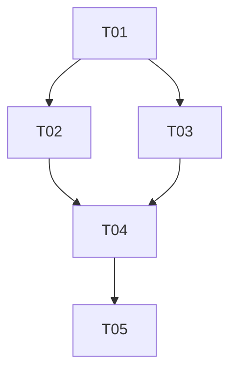

# Tareas de la Fase {{FASE_NUMERO}}: {{FASE_NOMBRE}}

> **Proyecto:** {{PROYECTO_NOMBRE}} ({{PROYECTO_TIPO}})  
> **Stack principal:** {{TECNOLOGIAS_PRINCIPALES}}  
> **Objetivo de la fase:** {{OBJETIVO_FASE_BREVE}}

## Resumen de Tareas

**Total de tareas:** {{TOTAL_TAREAS}}  
**Completadas:** 0  
**En progreso:** 0  
**Pendientes:** {{TOTAL_TAREAS}}  
**Bloqueadas:** 0

## Tareas por Categoría

{{#CATEGORIAS_TAREAS}}
### {{EMOJI}} {{NOMBRE_CATEGORIA}}

{{#TAREAS}}
- [ ] **[{{ID}}]** {{NOMBRE}}
  - **Descripción:** {{DESCRIPCION}}
  - **Tecnologías específicas:** {{TECNOLOGIAS_ESPECIFICAS}}
  - **Esfuerzo:** {{ESFUERZO}} ({{JUSTIFICACION_ESFUERZO}})
  - **Dependencias:** {{DEPENDENCIAS}}
  - **Estado:** Pendiente
  - **Recursos:** {{RECURSOS_UTILES}}

{{/TAREAS}}
{{/CATEGORIAS_TAREAS}}

- [ ] **[T02]** [Nombre de la tarea]
  - **Descripción:** [Qué hay que hacer]
  - **Esfuerzo:** S | M | L | XL
  - **Dependencias:** [Qué debe estar listo antes]
  - **Estado:** Pendiente | En progreso | Completada | Bloqueada

### 💻 Desarrollo

- [ ] **[T03]** [Nombre de la tarea]
  - **Descripción:** [Qué hay que hacer]
  - **Esfuerzo:** S | M | L | XL
  - **Dependencias:** [Qué debe estar listo antes]
  - **Estado:** Pendiente | En progreso | Completada | Bloqueada

### 🧪 Testing y Validación

- [ ] **[T04]** [Nombre de la tarea]
  - **Descripción:** [Qué hay que hacer]
  - **Esfuerzo:** S | M | L | XL
  - **Dependencias:** [Qué debe estar listo antes]
  - **Estado:** Pendiente | En progreso | Completada | Bloqueada

### 📚 Documentación

- [ ] **[T05]** [Nombre de la tarea]
  - **Descripción:** [Qué hay que hacer]
  - **Esfuerzo:** S | M | L | XL
  - **Dependencias:** [Qué debe estar listo antes]
  - **Estado:** Pendiente | En progreso | Completada | Bloqueada

## Flujo de Tareas

| ID | Tarea | Esfuerzo | Dependencias | Estado |
|----|-------|----------|-------------|--------|
| T01 | [Nombre] | S/M/L/XL | - | Pendiente |
| T02 | [Nombre] | S/M/L/XL | T01 | Pendiente |
| T03 | [Nombre] | S/M/L/XL | T01 | Pendiente |

## Dependencias Entre Tareas

## Notas de Progreso

### Estado Actual
- **Tareas completadas:** [Lista de tareas finalizadas]
- **En progreso:** [Tarea actualmente en desarrollo]
- **Bloqueadores activos:** [Impedimentos identificados]
- **Próxima tarea:** [Siguiente tarea a abordar]

## Consideraciones por Tarea

| Tarea | Complejidad | Riesgos | Notas |
|-------|-------------|---------|-------|
| T01 | Baja/Media/Alta | [Qué podría complicarse] | [Observaciones importantes] |
| T02 | Baja/Media/Alta | [Qué podría complicarse] | [Observaciones importantes] |

## Criterios de Aceptación

### Para cada tarea completada:
- [ ] Código revisado y aprobado
- [ ] Tests unitarios pasando
- [ ] Documentación actualizada
- [ ] Validación funcional exitosa

