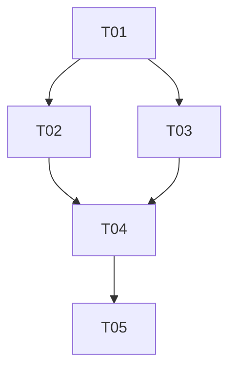

# Tareas de la Fase XX

## Resumen de Tareas

**Total de tareas:** 0  
**Completadas:** 0  
**En progreso:** 0  
**Pendientes:** 0  
**Bloqueadas:** 0  

## Tareas por Categoría

### 🏗️ Arquitectura y Diseño

- [ ] **[T01]** [Nombre de la tarea]
  - **Descripción:** [Qué hay que hacer]
  - **Estimación:** [Tiempo estimado]
  - **Responsable:** [Persona asignada]
  - **Dependencias:** [Qué debe estar listo antes]
  - **Estado:** Pendiente | En progreso | Completada | Bloqueada

- [ ] **[T02]** [Nombre de la tarea]
  - **Descripción:** [Qué hay que hacer]
  - **Estimación:** [Tiempo estimado]
  - **Responsable:** [Persona asignada]
  - **Dependencias:** [Qué debe estar listo antes]
  - **Estado:** Pendiente | En progreso | Completada | Bloqueada

### 💻 Desarrollo

- [ ] **[T03]** [Nombre de la tarea]
  - **Descripción:** [Qué hay que hacer]
  - **Estimación:** [Tiempo estimado]
  - **Responsable:** [Persona asignada]
  - **Dependencias:** [Qué debe estar listo antes]
  - **Estado:** Pendiente | En progreso | Completada | Bloqueada

### 🧪 Testing y Validación

- [ ] **[T04]** [Nombre de la tarea]
  - **Descripción:** [Qué hay que hacer]
  - **Estimación:** [Tiempo estimado]
  - **Responsable:** [Persona asignada]
  - **Dependencias:** [Qué debe estar listo antes]
  - **Estado:** Pendiente | En progreso | Completada | Bloqueada

### 📚 Documentación

- [ ] **[T05]** [Nombre de la tarea]
  - **Descripción:** [Qué hay que hacer]
  - **Estimación:** [Tiempo estimado]
  - **Responsable:** [Persona asignada]
  - **Dependencias:** [Qué debe estar listo antes]
  - **Estado:** Pendiente | En progreso | Completada | Bloqueada

## Cronograma de Tareas

| ID | Tarea | Inicio Est. | Fin Est. | Inicio Real | Fin Real | Estado |
|----|-------|-------------|----------|-------------|----------|---------|
| T01 | [Nombre] | YYYY-MM-DD | YYYY-MM-DD | - | - | Pendiente |
| T02 | [Nombre] | YYYY-MM-DD | YYYY-MM-DD | - | - | Pendiente |
| T03 | [Nombre] | YYYY-MM-DD | YYYY-MM-DD | - | - | Pendiente |

## Dependencias Entre Tareas

## Notas de Progreso

### [YYYY-MM-DD]
- **Tareas iniciadas:** [Lista]
- **Tareas completadas:** [Lista]
- **Bloqueadores:** [Problemas encontrados]
- **Decisiones:** [Cambios en el plan]

### [YYYY-MM-DD]
- **Tareas iniciadas:** [Lista]
- **Tareas completadas:** [Lista]
- **Bloqueadores:** [Problemas encontrados]
- **Decisiones:** [Cambios en el plan]

## Riesgos por Tarea

| Tarea | Riesgo | Probabilidad | Impacto | Mitigación |
|-------|--------|--------------|---------|------------|
| T01 | [Descripción del riesgo] | Alta/Media/Baja | Alto/Medio/Bajo | [Estrategia] |
| T02 | [Descripción del riesgo] | Alta/Media/Baja | Alto/Medio/Bajo | [Estrategia] |

## Criterios de Aceptación

### Para cada tarea completada:
- [ ] Código revisado y aprobado
- [ ] Tests unitarios pasando
- [ ] Documentación actualizada
- [ ] Validación funcional exitosa

---
*Última actualización: [Fecha]*  
*Responsable del seguimiento: [Nombre]*