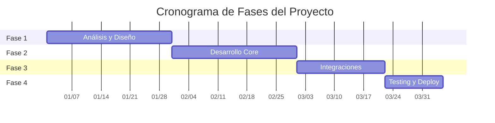

# Cronograma General del Proyecto

## Información del Proyecto

**Nombre del Proyecto:** [Nombre del proyecto]  
**Fecha de Inicio:** [YYYY-MM-DD]  
**Fecha Estimada de Finalización:** [YYYY-MM-DD]  
**Estado General:** No iniciado | En progreso | Completado | En pausa  
**Progreso General:** 0%

## Timeline de Fases



## Estado de Fases

| Fase | Nombre | Estado | Inicio Estimado | Fin Estimado | Inicio Real | Fin Real | Progreso | Bloqueadores |
|------|--------|---------|----------------|--------------|-------------|----------|----------|--------------|
| 01 | [Nombre Fase 1] | No iniciada | YYYY-MM-DD | YYYY-MM-DD | - | - | 0% | - |
| 02 | [Nombre Fase 2] | No iniciada | YYYY-MM-DD | YYYY-MM-DD | - | - | 0% | - |
| 03 | [Nombre Fase 3] | No iniciada | YYYY-MM-DD | YYYY-MM-DD | - | - | 0% | - |

## Dependencias Entre Fases

### Fase 01 → Fase 02
- **Entregables requeridos:**
  - [Entregable A] de Fase 01
  - [Entregable B] de Fase 01
- **Criterios de paso:** [Qué debe estar completo]

### Fase 02 → Fase 03
- **Entregables requeridos:**
  - [Entregable C] de Fase 02
  - [Entregable D] de Fase 02
- **Criterios de paso:** [Qué debe estar completo]

### Fase 03 → Fase 04
- **Entregables requeridos:**
  - [Entregable E] de Fase 03
- **Criterios de paso:** [Qué debe estar completo]

## Hitos Principales

| Hito | Descripción | Fecha Objetivo | Fecha Real | Estado | Responsable |
|------|-------------|----------------|-------------|---------|-------------|
| H01 | [Nombre del hito] | YYYY-MM-DD | - | Pendiente | [Nombre] |
| H02 | [Nombre del hito] | YYYY-MM-DD | - | Pendiente | [Nombre] |
| H03 | [Nombre del hito] | YYYY-MM-DD | - | Pendiente | [Nombre] |
| H04 | [Nombre del hito] | YYYY-MM-DD | - | Pendiente | [Nombre] |

## Recursos y Asignaciones

### Por Fase

#### Fase 01: [Nombre]
- **Equipo asignado:** [Lista de personas/roles]
- **Esfuerzo estimado:** [Horas/días persona]
- **Recursos especiales:** [Herramientas, servicios, etc.]

#### Fase 02: [Nombre]
- **Equipo asignado:** [Lista de personas/roles]
- **Esfuerzo estimado:** [Horas/días persona]
- **Recursos especiales:** [Herramientas, servicios, etc.]

#### Fase 03: [Nombre]
- **Equipo asignado:** [Lista de personas/roles]
- **Esfuerzo estimado:** [Horas/días persona]
- **Recursos especiales:** [Herramientas, servicios, etc.]

### Recursos Compartidos
- **[Recurso compartido]:** [Qué fases lo usan y cuándo]
- **[Especialista clave]:** [Disponibilidad y asignación]

## Riesgos del Cronograma

| Riesgo | Fases Afectadas | Probabilidad | Impacto | Días de Retraso | Mitigación | Estado |
|--------|----------------|--------------|---------|-----------------|------------|---------|
| [Descripción] | Fase XX, YY | Alta/Media/Baja | Alto/Medio/Bajo | XX días | [Estrategia] | Activo/Cerrado |
| [Descripción] | Fase XX | Alta/Media/Baja | Alto/Medio/Bajo | XX días | [Estrategia] | Activo/Cerrado |

## Buffer y Contingencias

### Buffer de Tiempo
- **Buffer entre fases:** X días
- **Buffer total del proyecto:** X% del cronograma
- **Razón del buffer:** [Explicación de por qué es necesario]

### Planes de Contingencia
- **Si Fase 01 se retrasa >1 semana:** [Plan específico]
- **Si recurso clave no disponible:** [Plan alternativo]
- **Si dependencia externa se retrasa:** [Estrategia]

## Métricas de Seguimiento

### Indicadores de Progreso
- **Porcentaje de fases completadas:** 0/X (0%)
- **Tareas completadas vs planificadas:** 0/X (0%)
- **Variación de cronograma:** 0 días
- **Variación de esfuerzo:** 0 horas

### Tendencias
- **Velocidad promedio:** [Tareas/semana]
- **Eficiencia:** [Real vs estimado]
- **Predictibilidad:** [Varianza en estimaciones]

## Comunicaciones del Cronograma

### Reportes de Estado
- **Frecuencia:** [Semanal/Quincenal]
- **Audiencia:** [Stakeholders]
- **Formato:** [Dashboard/Reporte/Reunión]
- **Responsable:** [Nombre]

### Reuniones de Seguimiento
- **Daily standups:** [Días y hora]
- **Phase reviews:** [Al final de cada fase]
- **Milestone checkpoints:** [En cada hito]

## Historial de Cambios

### [YYYY-MM-DD] - Cronograma inicial
- **Cambio:** Creación del cronograma base
- **Razón:** Inicio del proyecto
- **Impacto:** N/A
- **Aprobado por:** [Nombre]

### [YYYY-MM-DD] - [Descripción del cambio]
- **Cambio:** [Qué se modificó]
- **Razón:** [Por qué fue necesario]
- **Impacto:** [En fechas, recursos, etc.]
- **Aprobado por:** [Nombre]

## Dashboard Ejecutivo

### Estado General
```
Proyecto: ████████████████████████████ 0%
Fase 01:  ████████████████████████████ 0%
Fase 02:  ████████████████████████████ 0%
Fase 03:  ████████████████████████████ 0%
```

### Alertas Activas
- 🔴 **Crítico:** [Descripción si hay]
- 🟡 **Atención:** [Descripción si hay]
- 🟢 **OK:** Proyecto dentro de parámetros normales

### Próximos Hitos (30 días)
- **[Fecha]:** [Hito próximo]
- **[Fecha]:** [Siguiente hito]

---
*Última actualización: [Fecha]*  
*Project Manager: [Nombre]*  
*Próxima revisión: [Fecha]*