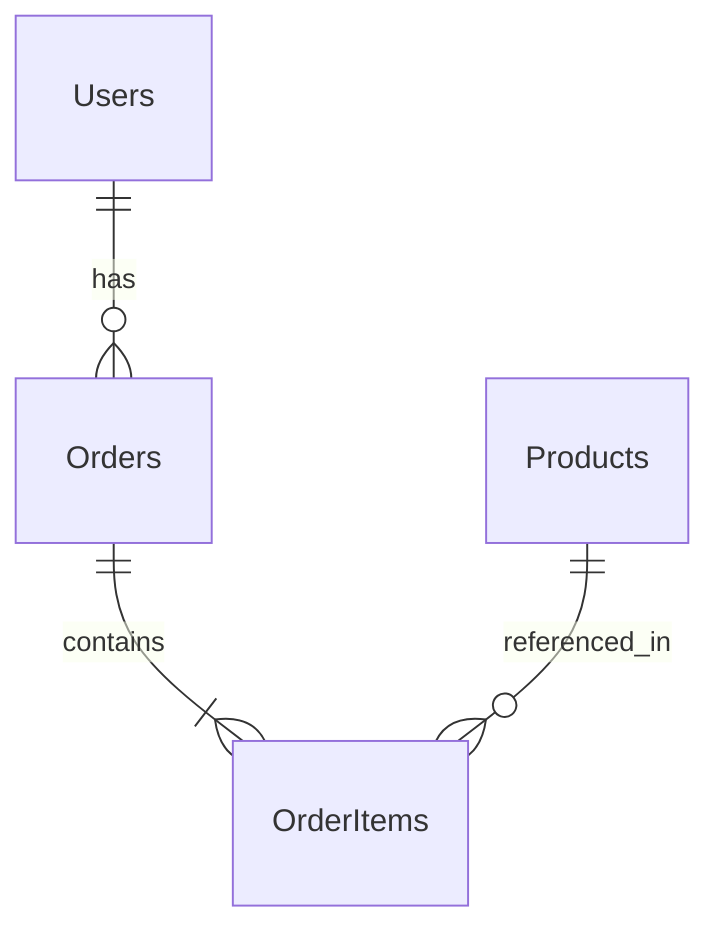

# Database Stack: [Nombre del Proyecto]

**Última actualización:** YYYY-MM-DD  
**Responsable:** [Nombre del DBA/Backend Lead]

## Resumen de Base de Datos

[Descripción de la estrategia de datos y arquitectura de persistencia]

## Stack de Datos

### Base de Datos Principal
| Tecnología | Versión | Propósito | Estado |
|------------|---------|-----------|---------|
| [PostgreSQL/MySQL/MongoDB] | vX.X | Base principal | ✅ |
| [Redis] | vX.X | Cache/Sessions | ✅ |
| [Elasticsearch] | vX.X | Search engine | 🔄 |

### ORM y Conectividad
| Tecnología | Versión | Propósito |
|------------|---------|-----------|
| [Prisma/TypeORM/Mongoose] | vX.X | ORM principal |
| [Connection pooling] | vX.X | Pool de conexiones |

## Diseño de Base de Datos

### Arquitectura de Datos


### Tablas Principales
```sql
-- Ejemplo de estructura principal
CREATE TABLE users (
    id UUID PRIMARY KEY DEFAULT gen_random_uuid(),
    email VARCHAR(255) UNIQUE NOT NULL,
    password_hash VARCHAR(255) NOT NULL,
    created_at TIMESTAMP DEFAULT CURRENT_TIMESTAMP,
    updated_at TIMESTAMP DEFAULT CURRENT_TIMESTAMP
);

CREATE INDEX idx_users_email ON users(email);
CREATE INDEX idx_users_created_at ON users(created_at);
```

### Relaciones y Constraints
- **Foreign Keys:** [Estrategia de integridad referencial]
- **Indexes:** [Estrategia de indexación]
- **Constraints:** [Check constraints, unique constraints]
- **Triggers:** [Si se usan, para qué propósito]

## Migraciones y Schema Management

### Estrategia de Migraciones
```bash
# Estructura de migraciones
migrations/
├── 001_initial_schema.sql
├── 002_add_user_profiles.sql
├── 003_create_orders_table.sql
└── rollbacks/
    ├── 002_rollback.sql
    └── 003_rollback.sql
```

### Herramientas
- **Migration tool:** [Prisma Migrate/TypeORM/Flyway/Liquibase]
- **Schema versioning:** [Git-based/Tool-specific]
- **Rollback strategy:** [Manual/Automated]

### Proceso de Deployment
```bash
# Proceso de migración
1. Backup database
2. Run migrations in staging
3. Validate migration
4. Run in production
5. Verify data integrity
```

## Performance y Optimización

### Índices Estratégicos
```sql
-- Índices principales
CREATE INDEX CONCURRENTLY idx_users_active_email 
ON users(email) WHERE active = true;

CREATE INDEX idx_orders_user_date 
ON orders(user_id, created_at DESC);

-- Índices compuestos
CREATE INDEX idx_products_category_price 
ON products(category_id, price);
```

### Query Optimization
- **Slow query log:** [Configurado/Threshold]
- **Query analysis:** [EXPLAIN ANALYZE usage]
- **N+1 prevention:** [Eager loading strategy]
- **Pagination:** [Cursor-based/Offset-based]

### Métricas Target
- **Query response:** < 100ms (95th percentile)
- **Connection pool:** < 80% utilization
- **Index hit ratio:** > 99%
- **Cache hit ratio:** > 95%

## Backup y Recovery

### Estrategia de Backup
```bash
# Automated backup schedule
Daily: Full backup + WAL archiving
Weekly: Full backup verification
Monthly: Disaster recovery test
```

### Recovery Planning
- **RTO (Recovery Time):** < 4 hours
- **RPO (Recovery Point):** < 15 minutes
- **Backup retention:** 30 days daily, 12 months monthly
- **Cross-region backup:** [Sí/No - estrategia]

### Testing de Recovery
```bash
# Recovery testing checklist
- [ ] Restore from latest backup
- [ ] Verify data integrity
- [ ] Test application connectivity
- [ ] Validate performance
- [ ] Document recovery time
```

## Seguridad de Datos

### Access Control
```sql
-- Roles y permisos
CREATE ROLE app_read;
CREATE ROLE app_write;
CREATE ROLE app_admin;

GRANT SELECT ON ALL TABLES IN SCHEMA public TO app_read;
GRANT INSERT, UPDATE ON ALL TABLES IN SCHEMA public TO app_write;
```

### Medidas de Seguridad
- [ ] **Encryption at rest:** Configurado
- [ ] **Encryption in transit:** SSL/TLS requerido
- [ ] **Access logging:** Habilitado
- [ ] **Row Level Security:** [Implementado si aplica]
- [ ] **Data masking:** [Para entornos no productivos]
- [ ] **Audit trail:** [Para tablas críticas]

### Compliance
- **GDPR:** [Medidas implementadas]
- **Data retention:** [Políticas de retención]
- **PII handling:** [Estrategia de datos personales]

## Monitoring y Alertas

### Métricas Monitoreadas
```yaml
# Métricas clave
- connection_count
- query_duration_95th
- lock_waits
- deadlocks_count
- cache_hit_ratio
- disk_usage
- replication_lag
```

### Alertas Configuradas
- **High connection count:** > 80% of max
- **Slow queries:** > 1 second
- **Disk space:** > 85% usage
- **Replication lag:** > 30 seconds
- **Failed connections:** > 10 per minute

### Herramientas
- **Monitoring:** [Prometheus/DataDog/CloudWatch]
- **Alerting:** [PagerDuty/Slack/Email]
- **Dashboards:** [Grafana/Custom]

## Environments

### Development
```yaml
# Configuración local
host: localhost
port: 5432
database: myapp_dev
connections: 10
ssl: false
```

### Staging
```yaml
# Configuración staging
host: staging-db.internal
database: myapp_staging
connections: 20
ssl: true
backup: daily
```

### Production
```yaml
# Configuración producción
host: prod-db-cluster.internal
database: myapp_prod
connections: 100
ssl: required
backup: continuous
monitoring: full
```

## Scaling Strategy

### Read Replicas
```yaml
# Configuración de replicas
master: write_db_host
replicas:
  - read_replica_1 (read-only)
  - read_replica_2 (read-only)
  - analytics_replica (analytics queries)
```

### Connection Pooling
```javascript
// Configuración del pool
{
  min: 10,
  max: 100,
  acquireTimeoutMillis: 60000,
  idleTimeoutMillis: 600000
}
```

### Partitioning Strategy
- **Horizontal partitioning:** [Por fecha/usuario/región]
- **Vertical partitioning:** [Separación por dominio]
- **Sharding:** [Si aplica - estrategia]

## Data Analytics

### Data Warehouse
- **ETL Process:** [Batch/Real-time/Hybrid]
- **Analytics DB:** [Separate instance/Same cluster]
- **BI Tools:** [Tableau/PowerBI/Custom dashboards]

### Reporting
```sql
-- Queries comunes de reporting
-- Daily active users
-- Revenue by period
-- Performance metrics
```

## Troubleshooting

### Logs Importantes
```bash
# PostgreSQL logs importantes
grep "ERROR" /var/log/postgresql/postgresql.log
grep "slow query" /var/log/postgresql/postgresql.log

# Monitoring queries
SELECT * FROM pg_stat_activity WHERE state = 'active';
SELECT * FROM pg_stat_user_tables ORDER BY seq_tup_read DESC;
```

### Common Issues
- **Lock contention:** [Identificación y resolución]
- **Memory issues:** [Tuning parameters]
- **Connection exhaustion:** [Pool configuration]
- **Slow queries:** [Optimization approach]

## Data Seeding y Testing

### Test Data Strategy
```bash
# Scripts de seeding
npm run seed:development   # Datos de desarrollo
npm run seed:test         # Datos para testing
npm run seed:demo         # Datos para demos
```

### Data Anonymization
```sql
-- Script de anonimización
UPDATE users SET 
  email = 'user_' || id || '@example.com',
  name = 'User ' || id
WHERE environment = 'test';
```

## ADRs Relacionados

- [ADR-XXX: Elección de Base de Datos](../../adr/ADR-XXX.md)
- [ADR-XXX: Estrategia de Caching](../../adr/ADR-XXX.md)
- [ADR-XXX: Backup and Recovery Strategy](../../adr/ADR-XXX.md)

---
*Template especializado para Database - stepwise-planner*